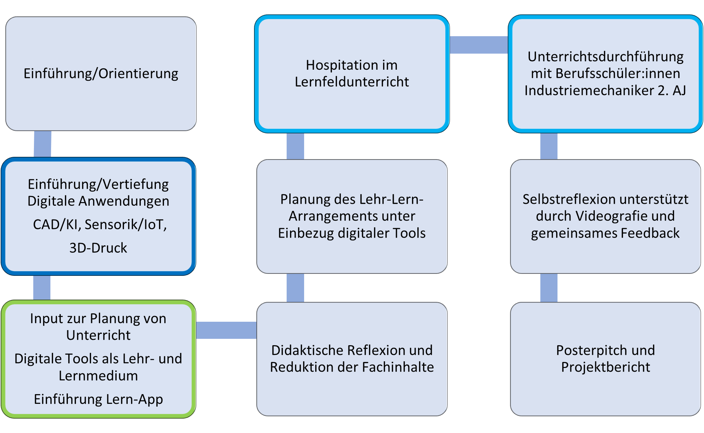
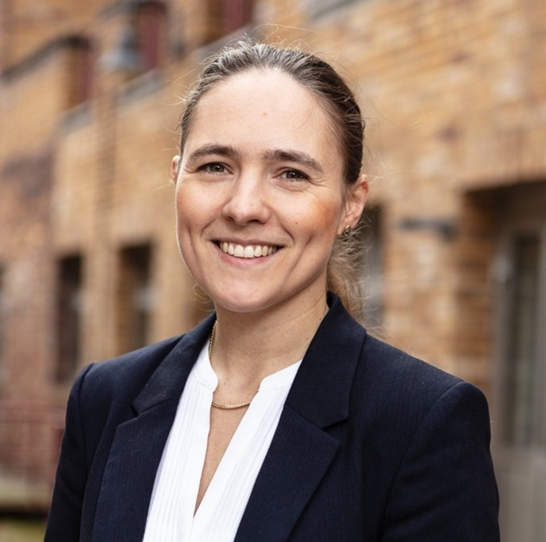

# Dokumentation des Projekts D³@TU macht Schule

**Gliederung**

- Kurzüberblick  
- Ausgangslage & Projektidee  
- Das Modul „Future Class“  
- Evaluation und zentrale Befunde  
- Zum Mitnehmen: Erfahrungen, Herausforderungen und Transfer  
- Materialien zum Download  
- Kontakt  

# D³@TU macht Schule
**Future Class: Zukunftstechnologien sinnvoll anwenden und vermitteln**

## Kurzüberblick
  
Das Projekt D³@TU macht Schule entwickelte und erprobte mit dem Modul _Future Class: Zukunftstechnologien sinnvoll anwenden und vermitteln_ ein praxisorientiertes Lehrformat für Bachelorstudierende der gewerblich-technischen Lehramtsstudiengänge an der Technischen Universität Berlin. Ziel des Projekts war die Förderung digitaler und digital-didaktischer Kompetenzen angehender Lehrkräfte durch die systematische Verbindung von Fachwissenschaft, Fachdidaktik und Unterrichtspraxis.  

Im Zentrum des Moduls steht die Entwicklung und Durchführung einer Unterrichtseinheit zu Zukunftstechnologien wie CAD, KI, additive Fertigung (3D-Druck) sowie Sensorik und Internet of Things (IoT). Die Studierenden lernen digitale Technologien der Ingenieurwissenschaften kennen und transformieren diese in interdisziplinären Gruppen zu Lehr-Lern-Arrangements für Auszubildende. Sie erproben und reflektieren digitale Tools zur Unterrichtsgestaltung, hospitieren an einer beruflichen Schule und führen schließlich ihre entwickelten Unterrichtskonzepte mit Berufsschüler:innen in authentischen Lernsettings durch. Die Erfahrungen aus Hospitation, Unterrichtserprobung und Zusammenarbeit in Gruppen sowie mit unterschiedlichen Lernorten werden kontinuierlich reflektiert und didaktisch eingeordnet.  

Das Modul entstand in enger Kooperation zwischen der Fachdidaktik gewerblich-technischer Fachrichtungen, mehreren ingenieurwissenschaftlichen Fachgebieten der TU Berlin, dem OSZ für Maschinen- und Fertigungstechnik sowie dem Entwicklerteam der Lern-App PROSUMIO. Die unterschiedlichen Akteure, Perspektiven und Lernorte bildeten die strukturprägende Grundlage des Projekts.

### Auf einen Blick
  
- Entwicklung eines innovativen Moduls zur Förderung digitaler Kompetenzen angehender Lehrkräfte  
- Zielgruppe: Bachelorstudierende gewerblich-technischer Lehramtsstudiengänge sowie Studierende ausgewählter ingenieurswissenschaftlicher Studiengänge der TU Berlin  
- Kooperation zwischen Universität, beruflicher Schule und Entwicklerteam der Lern-App PROSUMIO
- Integration von Lehr-Lerneinheiten zu CAD, KI, 3D-Druck sowie IoT und Sensorik  
- Praxisintegration durch Hospitation und eigene Unterrichtsplanung und -durchführung  
- Förderung digital-didaktischer Kompetenzen im Kontext beruflicher Bildung  
- Reflexion von Unterricht, Technologieeinsatz und individueller Kompetenzentwicklung  
- Wissenschaftliche Begleitung und Evaluation durch Vorher-Nachher-Befragungen  
- Entwicklung transferfähiger Materialien und Lehrkonzepte

### Kooperationspartner
- Technische Universität Berlin  
- SETUB  
- Fachdidaktik der gewerblich-technischen Fachrichtungen, Fakultät I – Geistes- und Bildungswissenschaften  
- Ingenieurwissenschaftliche Fachgebiete der Fakultät V – Verkehrs- und Maschinensysteme  
- Georg-Schlesinger-Schule (OSZ Maschinen- und Fertigungstechnik)  
- Entwicklerteam der Lern-App PROSUMIO  

### Themenschwerpunkte
- Digitale Kompetenzen  
- Berufliche Lehrkräftebildung  
- Kooperationen  
- Theorie-Praxis-Verknüpfung  
- Unterrichtserprobung  
- Reflexion  

## Ausgangslage und Projektidee
  
Die berufliche Lehrkräftebildung steht vor der Herausforderung, angehende Lehrkräfte auf eine zunehmend digitalisierte Arbeitswelt und Unterrichtspraxis vorzubereiten. Insbesondere in den gewerblich-technischen Berufsfeldern verändert die digitale Transformation und der Einsatz digitaler Anwendungen die beruflichen Arbeitsprozesse und damit die Anforderungen an die Fachkräfte und die berufliche Bildung.  

Gleichzeitig zeigt sich in der Lehrkräftebildung häufig eine Trennung zwischen fachwissenschaftlichen Inhalten, fachdidaktischer Reflexion und beruflicher Praxis. Studierende lernen digitale Technologien oftmals entweder aus einer technischen oder aus einer pädagogischen Perspektive kennen. Möglichkeiten, diese Perspektiven systematisch miteinander zu verbinden und in authentischen Lehr-Lern-Situationen zu erproben, sind dagegen bislang selten.  

Hier setzte das Projekt D³@TU macht Schule an. Ziel war die Entwicklung eines kooperativen und praxisorientierten Moduls, das Studierenden bereits im Bachelorstudium die Möglichkeit bietet,  

- digitale Technologien kennenzulernen und zu erproben  
- daraus berufliche Lehr-Lern-Arrangements zu entwickeln  
- diese mit Berufsschüler:innen durchzuführen  
- und den gesamten Prozess reflexiv zu begleiten  

Zentral war dabei die Zusammenarbeit der Kooperationspartner mit drei verschiedenen Perspektiven auf die Vermittlung digitaler Kompetenzen:  

- akademische Bildung (SETUB, Fak. I, Fak. V)  
- berufliche Bildung (Oberstufenzentren)  
- Entwickler eines digitalen Lernmediums (PROSUMIO)

## Das Modul „Future Class”
Das Modul _Future Class: Zukunftstechnologien sinnvoll anwenden und vermitteln_ mit einem Umfang von 4 SWS und 6 ECTS richtet sich an Bachelorstudierende der gewerblich-technischen Lehramtsstudiengänge sowie an Ingenieursstudierende an der Technischen Universität Berlin. Ziel ist es, Kenntnisse zu digitalen Technologien der Ingenieurwissenschaften zu erwerben oder zu vertiefen, diese mit fachdidaktischen Fragestellungen zu verbinden und darauffolgend eine konkrete Lehrerfahrung in der beruflichen Bildung zu ermöglichen.  

Im Mittelpunkt des Moduls steht die Entwicklung, Durchführung und Reflexion einer Unterrichtseinheit zu einer ausgewählten Zukunftstechnologie. Die Studierenden setzen sich mit Themen wie CAD, KI, additive Fertigung (3D-Druck) sowie Sensorik und Internet of Things (IoT) auseinander. Die fachwissenschaftlichen Inputs werden von verschiedenen Fachgebieten der Ingenieurswissenschaften vermittelt und mit praktischen Anwendungen ergänzt. Flankierend dazu beinhaltet die Einführung in die Fachdidaktik Grundlagen zur Unterrichtsplanung, Kennenlernen und Erproben digitaler Werkzeuge für die Unterrichtsgestaltung sowie eine Einführung in die Lern-App PROSUMIO.  

Auf dieser Grundlage entwickeln die Studierenden in interdisziplinären Gruppen unter fachdidaktischer Begleitung eigene Lehr-Lern-Arrangements für Berufsschüler:innen. Dieser Planungsprozess fokussiert darauf, komplexe technologische Inhalte didaktisch zu reduzieren, adressatengerecht mit Bezug zum Berufsfeld aufzubereiten und unter Einsatz digitaler Werkzeuge lernwirksam zu gestalten.  

Die entwickelten Unterrichtskonzepte werden mit Auszubildenden der kooperierenden Berufsschule durchgeführt, in Teilen videografiert und im Anschluss reflektiert.  
Die Verbindung unterschiedlicher Lernorte in der Modulumsetzung beinhaltet auch eine Hospitation am Oberstufenzentrum (Berufliche Schule).  
Die Reflexion des individuellen Lernprozesses der Studierenden ist kontinuierlicher Bestandteil des Moduls.

**Aufbau des Moduls**

*Abbildung 1: Modulverlauf*

**Eingesetzte Technologien und Themen**
- CAD  
- KI  
- 3D-Druck  
- Sensorik und Internet of Things (IoT)  
- Digitale Werkzeuge 

## Evaluation und zentrale Befunde
Das Projekt wurde durch qualitative und quantitative Evaluationsformate begleitet. Ziel war insbesondere die Untersuchung der Entwicklung digitaler und digital-didaktischer Kompetenzen der Studierenden sowie die Reflexion des Lernprozesses im Modul.  

Im Rahmen einer Vorher-Nachher-Befragung (N = 14) wurden unter anderem die Selbsteinschätzungen der Studierenden zu allgemeinen digitalen Kompetenzen (DigKomp2.2., Krempkow 2022[^1]), digitalen Kompetenzen als Lehrende (DigCompEdu 2019[^2]) sowie digitalen Anwendungen in technischen Berufen (CAD, KI, 3D, IoT) auf einer fünfstufigen Likert-Skala (1 = gar nicht, 5 = in sehr hohem Maße) erhoben.  
Die Befragung basiert auf etablierten Kompetenzrahmen und Instrumenten. Alle erfassten Items zeigen im Verlauf des Moduls positive Entwicklungen der Mittelwerte.  
Besonders deutlich zeigen sich Kompetenzzuwächse:  

im Bereich _Datenverarbeitung und -bewertung_ allgemeiner digitaler Kompetenzen,  
in der Teilkompetenz _Lehren_ digitaler Kompetenzen angehender Lehrkräfte,  
sowie im Bereich _additive Fertigung (3D-Druck)_ bei technologiebezogenen Anwendungen.  

Die Ergebnisse deuten darauf hin, dass insbesondere die Verbindung aus fachwissenschaftlicher Vertiefung, eigener Unterrichtsentwicklung, Unterrichtserprobung und Reflexion zur Kompetenzentwicklung der Studierenden beiträgt.  
Auch die qualitativen Rückmeldungen der Studierenden verdeutlichen den wahrgenommenen Mehrwert des Moduls. Besonders hervorgehoben werden die Verbindung von Theorie und Praxis, die eigenständige Unterrichtsdurchführung sowie die Reflexion des eigenen professionellen Handelns.  

Zwei Stimmen:  
„Insgesamt war die Möglichkeit, im Rahmen des Moduls eigenen Unterricht gestalten und durchzuführen, besonders lehrreich für mich und hat mir wichtige Einblicke in meinen zukünftigen Beruf als Berufsschullehrkraft gegeben. Darüber hinaus hat diese Erfahrung meinen Willen, meinen pädagogischen Abschluss zu erreichen, weiter gefestigt.“  

„Ein besonderes Highlight des Moduls war die Hospitation an der Georg-Schlesinger-Schule. Die Beobachtung des Unterrichts und der Einsatz digitaler Tools und der verwendeten Methoden in einer realen Unterrichtssituation bot wertvolle Einblicke und Anregungen für meine eigene Lehrtätigkeit.“  
In den Evaluationen und Projektberichten wird zudem deutlich, dass die verschiedenen Lernorte mit ihren spezifischen Perspektiven auf den Lerngegenstand von den Studierenden als besonders bereichernd wahrgenommen werden.  

## Zum Mitnehmen: Erfahrungen, Herausforderungen und Transfer 
Das Projekt _D³@TU macht Schule_ zeigt, dass die systematische Verbindung von Fachwissenschaft, Fachdidaktik und beruflicher Praxis einen wichtigen Beitrag zur Professionalisierung angehender Lehrkräfte leisten kann.  

Besonders positiv hervorzuheben ist die gelungene Kooperation zwischen den Lernorten und Akteuren. Die Studierenden konnten digitale Technologien nicht nur kennenlernen, sondern diese auch didaktisch transformieren, praktisch erproben und reflexiv einordnen.  

Für die Projektorganisation erwies sich die Kooperation zwischen Fachwissenschaft, Fachdidaktik und beruflicher Schule sowie Raum für die gemeinsame Planung, Reflexion und Abstimmung aller Beteiligten als zentral.  

In der Umsetzung des Moduls werden die Aspekte der Unterrichtserprobung bereits im Bachelorstudium und die didaktische Reflexion des Technologieeinsatzes von den Studierenden besonders bereichernd wahrgenommen.  

Gleichzeitig machte das Projekt deutlich, dass kooperative und praxisorientierte Lehrformate mit erhöhtem Abstimmungs- und Organisationsaufwand verbunden sind.  

Die Einbeziehung aller beteiligten Akteure erforderte kontinuierliche Kommunikation und flexible Abstimmungsprozesse sowohl fakultätsübergreifend als auch zwischen Universität, Schule und weiteren Praxispartnern.  

Auch die Entwicklung geeigneter Evaluationsinstrumente und die Datenanalyse erwiesen sich als deutlich zeitintensiver als ursprünglich geplant.  
Die Integration der Lern-App PROSUMIO stellte sich anfänglich als Hürde dar. Während der ersten Moduldurchführung befand sich die App noch im Entwicklungsprozess, sodass den Studierenden nur eingeschränkte Funktionen zur Verfügung standen. Dies führte dazu, dass die App von Teilen der Studierenden zunächst als wenig relevant für das Modul wahrgenommen wurde.  
Herausfordernd war zudem die Akquise von Studierenden. Da die Teilnehmendenzahlen im Vorfeld nur schwer planbar waren, bestand wiederholt Unsicherheit hinsichtlich der Durchführung des Moduls. Aufgrund dieser Unsicherheit wird ab dem Wintersemester 2026/27 von einem einsemestrigen Turnus zu einem zweisemestrigen Turnus gewechselt. Zudem wird an einer stärkeren Sichtbarkeit und Öffnung des Moduls für interessierte Studierende weiterer Studiengänge gearbeitet.  
Darüber hinaus zeigte sich die curriculare Integration innovativer Lehrformate als anspruchsvoll. Die Einbindung zusätzlicher praxis- und digitalisierungsbezogener Inhalte erfordert Anpassungen bestehender Curricula und steht häufig in Konkurrenz zu bereits etablierten Studieninhalten.  
Die Verstetigung eines solchen kooperativen Lehrformats über die Projektlaufzeit hinaus erfordert Durchhaltevermögen. Insbesondere die langfristige Sicherung personeller Ressourcen und die Aufrechterhaltung der Kooperationen stellt sich nach Auslaufen der Projektförderung als eine der zentralen Herausforderungen dar.

### Materialien zum Download
- Modulbeschreibung und Seminarverlauf  
- Evaluationsinstrument zur Selbsteinschätzung digitaler Kompetenzen  
- Ausgewählte Unterrichtskonzepte und Materialien  
- Posterpräsentation und Veröffentlichungen
  
- Modulbeschreibung 51127 Future Class_ Zukunftstechnologien sinnvoll anwenden und vermitteln (25.06.2026).pdf
- Präsentation 35.Fachtagung Bundesarbeitsgemeinschaft für Berufsbildung ET,IT,MT,FT.pdf
- Semesterverlauf.pdf
- Future Class_HTBB.pdf
- Future Class_TU Berlin.pdf

**Veröffentlichungen**

Derda, M., Albrecht, M., & Wedel, M. (2025). Digitalisierung lernen, Digitalisierung lehren: Kompetenzerwerb angehender Lehrkräfte mit Hilfe institutsübergreifender Kooperationen. In T. Wiemer, M. Binder, & I. Penning (Hrsg.), _DGTB 26_ (S. 89–104). Universitätsverlag Potsdam. https://doi.org/10.25932/publishup-68569  

Derda, M., Lohse, C. & Blömer, L. (2026, in Druck): Future Class: Zukunftstechnologien sinnvoll anwenden und vermitteln. In V1. Hrsg-1, V2. Hrsg-2, & V3. Hrsg-3, bwp@ Spezial HT2025 mit Titel (S. 1–XY). http://www.bwpat.de/ht2025/name1_name2_ht2025.pdf   

Derda, M. & Blömer, L. (2026, in Druck): Future Class – Praxisorientierte Entwicklung digitaler Kompetenzen in der beruflichen Bildung. In _didacticum - Zeitschrift für (Fach)Didaktik in Forschung und Unterricht der Pädagogischen Hochschule Steiermark_, Bd. 8(1) ISSN 2707-0905  

Derda, M. & Lohse, C. (2026, in Vorbereitung): Future Class - Ein auf Kooperation basierendes Lehrkonzept in der ersten Phase der gewerblich-technischen Lehrkräftebildung. In W. Reichwein & C. Lohse (Hrsg.), _BAG._ wbv Verlag.

## Kontakt              

**Dr. Mareen Derda**  
_Geschäftsführung der School of Education der Technischen Universität Berlin_  
mareen.derda@tu-berlin.de

**Dr. Carolin Lohse**  
_Fachgebiet Fachdidaktik der Technik_  
c.lohse@tu-berlin.de

---

### Fußnoten

[^1]: Krempkow, R. (2022): DigKomp2.2de. Erhebung digitaler Kompetenzen gemäß DigComp2.1-Referenzrahmen der EU [Verfahrensdokumentation, Fragebogen]. In Leibniz-Institut für Psychologie (ZPID) (Hrsg.), Open Test Archive. Trier: ZPID. https://doi.org/10.23668/psycharchives.6599  

[^2]: DigCompEdu - Redecker, C. & Punie, Y. (Hrsg.) (2019). Europäischer Rahmen für digitale Kompetenzen Lehrender, Übersetzung: Goethe-Institut e.V.
