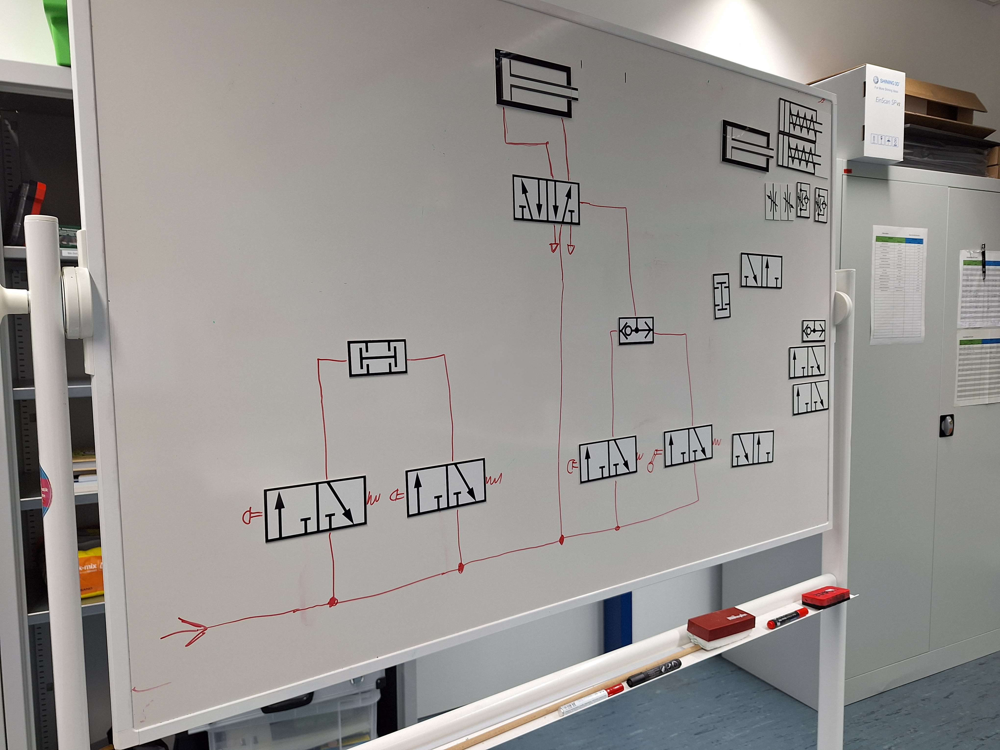
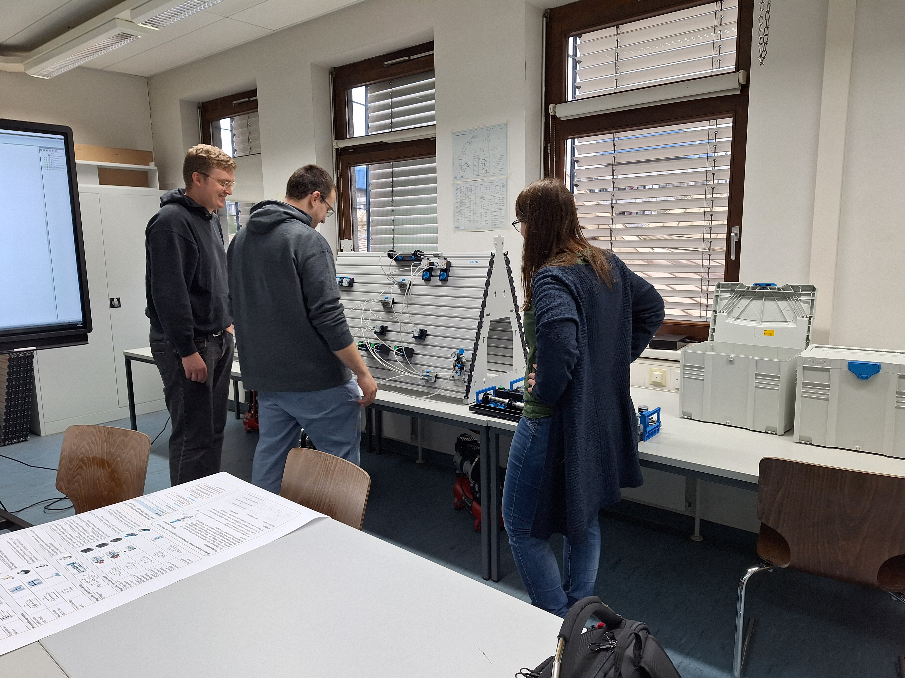
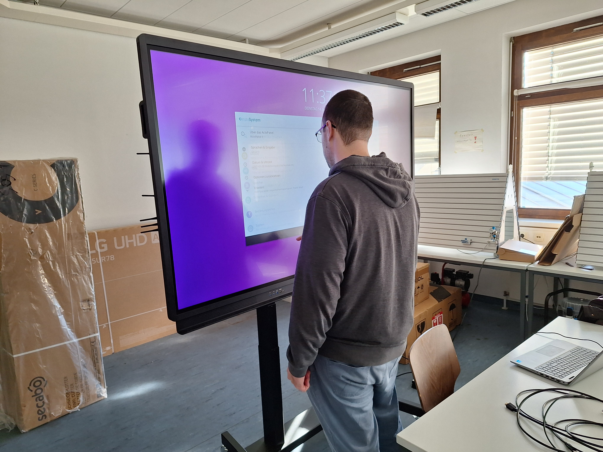
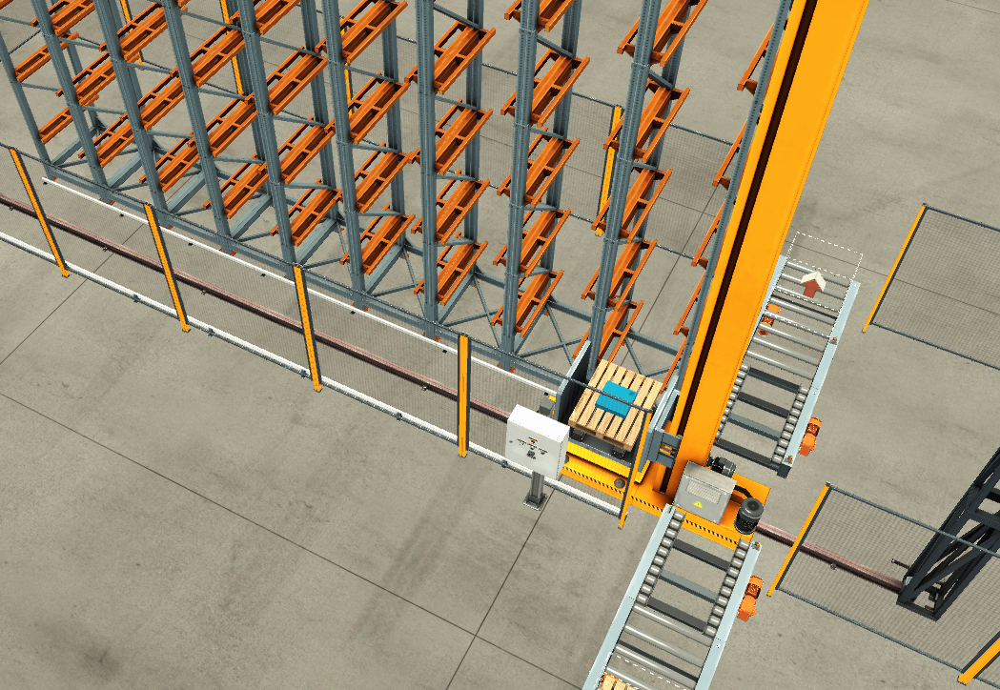
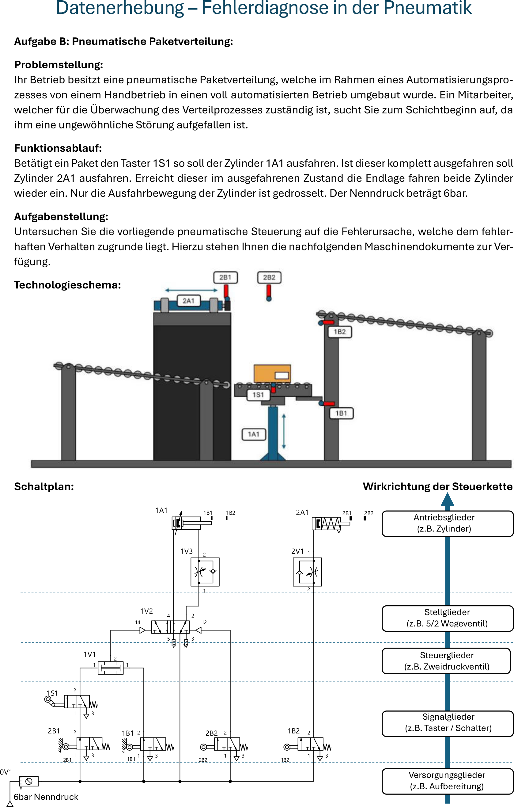
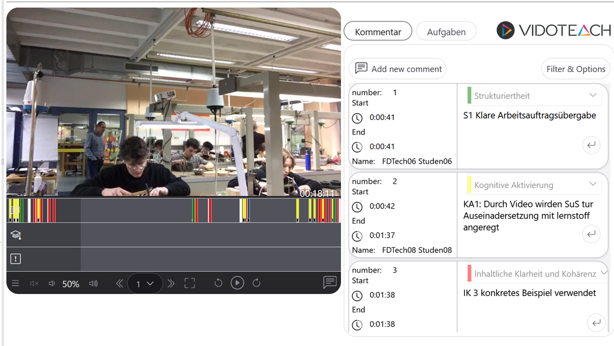
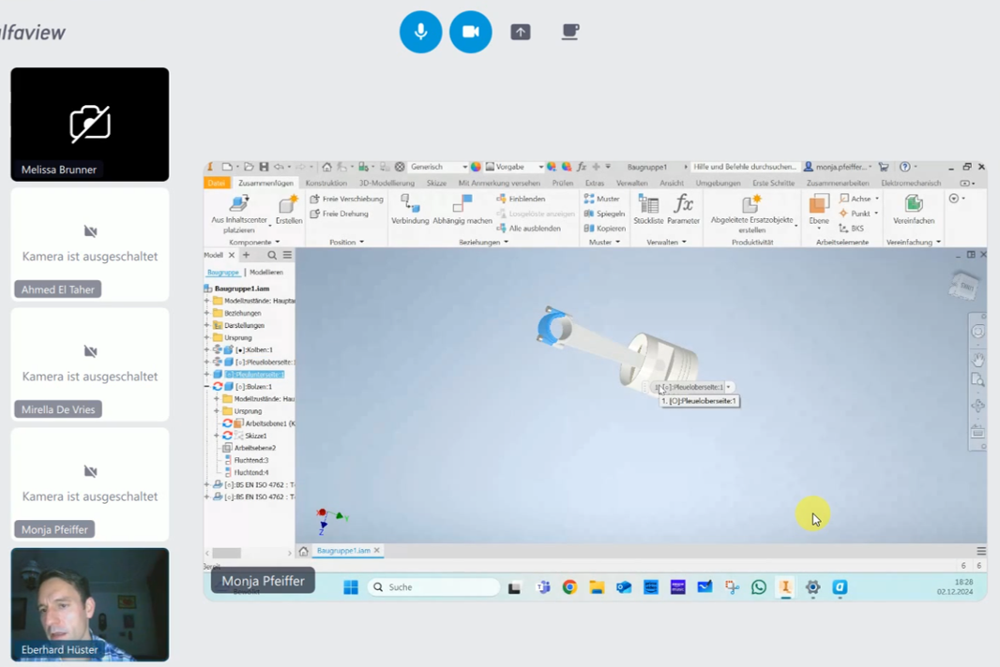
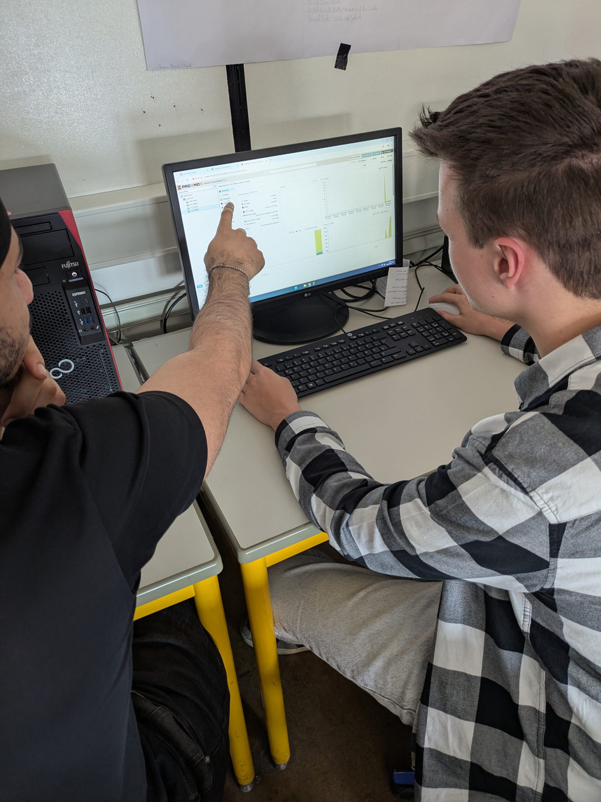
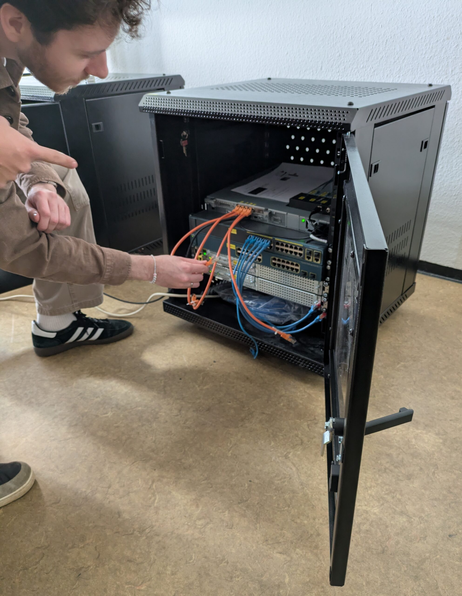

# Konzeptioneller Hintergrund des Projekts
Internationale Vergleichsstudien zu digitalisierungsbezogenen Kompetenzen, wie beispielsweise die ICILS 2018 (Eickelmann et al., 2019), zeigen, dass die „digital natives“ nicht allein deshalb Medienkompetenz erwerben, weil sie mit digitalen Medien aufwachsen. Da die Lehrkraft von besonderer Bedeutung für die gelingende Gestaltung von Lehr-Lernprozessen ist (Richter, Stanat & Anand Pant, 2014), kommt dem Erwerb von Medienkompetenz im Lehramtsstudium eine zentrale Bedeutung zu. Die KMK-Strategie „Bildung in einer digitalen Welt“ (KMK, 2016) bekräftigt dabei den Auftrag der Schulen, die Schüler*innen auf eine Gesellschaft im technologischen Wandel vorzubereiten. Insbesondere in der beruflichen Bildung greifen diese technologischen Innovationsprozesse umfassend in die einzulösenden Anforderungsstrukturen für Lehrende und Lernende ein, da sich die unmittelbaren Gegebenheiten bei beiden dualen Partnern kontinuierlich weiterentwickeln. Entsprechend wichtig ist es, dass Lehramtsstudierende im Verlauf des Studiums auf Anforderungssituationen ihres späteren Berufs vorbereitet werden. Der Nationale Bildungsbericht „Bildung in Deutschland“ (Autorengruppe Bildungsberichterstattung, 2020) konstatiert dabei, dass rund ein Drittel der Lehramtsstudierenden die universitäre Phase ohne dezidierte Veranstaltungen zum Erwerb von Medienkompetenz verlässt. Zudem konnte u.a. aus den PISA-Erhebungen 2015 ein heterogenes Bild der Lehramtsausbildung insgesamt abgeleitet werden. Dabei ist die Auseinandersetzung mit ICT-bezogenen Inhalten insbesondere in Deutschland geringer verankert als in anderen (außer)europäischen Ländern (van Waveren & Sälzer, 2019).
Als zentraler Gegenstand des berufsfachlichen Unterrichts ist die Förderung des Umgangs mit problemhaltigen Situationen (vgl. u.a. Pittich, 2016; Schäfer & Walker, 2018; Nitzschke et al., 2020) breit etabliert und bietet im gewerblich-technischen Bereich zahlreiche Anknüpfungspunkte für die Einbindung digital angereicherter Lehr-Lernarrangements. **Um eine systematische und zielgerichtete Förderung vorzunehmen und Lernzuwächse nachverfolgen zu können, bietet sich der Rückgriff auf ein rahmendes Theoriekonstrukt an.** Während im europäischen Raum das fachunabhängige DigCompEdu (Redecker, 2017) für Lehrende und Lernende jeweils eine Stufung erworbener Kompetenzen enthält, setzt das TPACK-Modell (Koehler, Mishra, Kereluik, Shin & Graham, 2014) den Schwerpunkt auf die rein kognitiven Wissensaspekte. Als Weiterentwicklung wurde der Kompetenzrahmen „Digitale Basiskompetenzen in der Lehramtsausbildung (DIKOLAN, Becker et al., 2020)“ entwickelt, der gegenwärtig auf die Ausbildung angehender Lehrkräfte in den Naturwissenschaften ausgerichtet ist und sich auf die dort gemeinsamen, digitalisierungsbezogenen Kompetenzen konzentriert (Dokumentation, Präsentation, Kommunikation/Kollaboration, Recherche und Bewertung, Messwert- und Datenerfassung, Datenverarbeitung sowie Simulation und Modellierung). Im Zuge des Projekts MINT-ProNeD: Kaiserslautern wurde hierzu inzwischen eine Übertragung in die technische Domäne als eigenständige Weiterentwicklung zum DIKOLAT (Boheim et al., 2025, s. Abschnitt „zum Mitnehmen“) vorgenommen, die während der Projektlaufzeit bereits an verschiedenen Stellen zur Referenzierung herangezogen wurde.
Um die Kompetenz von (angehenden) Lehrkräften zu fördern, ist es erforderlich, sowohl eine reflexive Komponente, die eine zeitunabhängige Betrachtung des Unterrichtsgegenstands beinhaltet, als auch eine **aktionsbezogene Komponente,** die auf unmittelbare Lehrkräfte-Lernenden-Interaktionen bezogen ist (Lindmeier, Heinze & Reiss, 2013), zu berücksichtigen. In enger Anlehnung an das COACTIV-Modell (Kunter et al., 2011) sind dabei Klassenführung, kognitive Aktivierung und individuelle Unterstützung als Merkmale qualitätsvollen Unterrichts (Holzberger & Kunter, 2016) von zentraler Bedeutung. Eine videogestützte Auseinandersetzung (Lohse-Bossenz, 2023) kann in diesem Kontext zur Steigerung der Reflexionsfähigkeit dienen.

## Lehr-Lernlabore an der RPTU
Als zwei Vorläuferprojekte der Berufsschul-Digi-Teams gab es an der RPTU bereits im Projekt "U.EDU-Medienbildung entlang der Lehrerbildungskette" im Rahmen der Qualitätsoffensive Lehrerbildung (BMBF, 2016-2023) einen Schwerpunkt im Bereich Digitalisierung sowie phasenübergreifende Qualifizierungskonzepte. Diese Ansätze wurden im Rahmen der Landesförderung Rheinland-Pfalz (2021-2023) zu den Digitalen Lehr-Lernlaboren (DIGILL) mit den Schwerpunkten Medienkompetenz-LehrLernLabor (MeKoLLL) und Future-LehrLernLabor (FuLLL) weiterentwickelt. Aus diesen Projekten ging u.a. über die Anknüpfung an das Forschungsprojekt MINT-ProNeD: Kaiserslautern (lernen:digital, BMBFSFJ) die bereits oben angesprochene theoretische Rahmung des DIKOLAT und Ansätze für adaptiven Fortbildungsangebote für Lehrkräfte hervor.

# DIGILL@Praxis
Das Projekt DIGILL@Praxis baute auf den Forschungsprojekten U.EDU und MINT-ProNeD auf und knüpfte unmittelbar an die Vorarbeiten aus den bereits eingerichteten Lehr-Lernlaboren an. Das Vorhaben zielte darauf ab, die hochschulische Lehramtsausbildung und die Unterrichtspraxis noch einmal enger miteinander zu verknüpfen und in ihrer Kohärenz zu stärken, um gezielt digitalisierungsbezogene Kompetenzen bei Studierenden der gewerblich-technischen Fachrichtungen beim Lehren und Lernen mit und durch digitale Medien phasenübergreifend zu fördern.	
Zu diesem Zweck kooperierten die Arbeitsgruppe Fachdidaktik in der Technik, das Studienseminar Speyer/Kaiserslautern sowie die beiden RPTU.net MINT-Netzwerkschulen BNT Trier und BBS1 Kaiserslautern.

## Universitäre Abschnitte von DIGILL@Praxis
Im Rahmen einer Lehrveranstaltung im Masterstudium der Fachrichtungen Elektrotechnik, Metalltechnik sowie Informatik/Informationstechnik wurden Gelegenheiten entwickelt und umgesetzt, die den Einbezug digitaler Medien in die fachdidaktische Gestaltung von Lehr-Lernsequenzen förderten.
Dabei nutzten die Studierenden einerseits die Möglichkeit, sich grundlegend mit dem Einsatz digitaler Medien – auf den Abbildungen exemplarisch am Beispiel des Smartboards dargestellt – vertraut zu machen. Dabei setzten sie sich u.a. auch mit der fachdidaktisch begründeten Aufbereitung von Materialien, z.B. in unterschiedlichen Repräsentationsformen auseinander (vgl. Kürschner, Schnotz & Eid, 2007; Mayer, 2024).  

(Bilder: RPTU/van Waveren)

Für enaktive Unterrichtseinstiege (Bruner, 1988) wurden beispielsweise CAD-basierte Lernarrangements entwickelt, die mithilfe eines Lasercutters umgesetzt wurden. Diese können perspektivisch auch in Ferien- oder Schüler*innenkursen zur Förderung des Interesses an MINT-Themen eingesetzt werden.

Aufgrund der zentralen Bedeutung der Problemorientierung im berufsbildenden Unterricht wurden darüber hinaus ergänzende Szenarien entwickelt. So entstand zur Förderung der Fehlerdiagnosekompetenz ein Simulationsprototyp eines automatisierten Warenhauses in Factory I/O, in dessen SPS-Steuerung gezielt fehlerbehaftete Umsetzungen implementiert wurden.

(erstellt mit Factory I/O)

In flankierenden Abschlussarbeiten wurden hierzu ergänzende Aufgabenstellungen entwickelt, die sich vertiefend mit dem Problemlöseprozess am Beispiel pneumatischer Systeme befassten und die Bearbeitungsprozesse mittels Eye-Tracking untersuchten (Beitrag in Vorbereitung).

 
(RPTU/Schüchel)

Ausgehend vom inzwischen veröffentlichten DIKOLAT-Kompetenzmodell standen insbesondere die Kompetenzbereiche Kommunikation und Kollaboration sowie Visualisierung und Präsentation im Zentrum des universitären Abschnitts des Projekts DIGILL@Praxis. 

## Phasenübergreifende Abschnitte
Das Vorhaben DIGILL@Praxis verfolgte das Ziel, phasenübergreifend Gelegenheiten zu schaffen, um den Einsatz digitaler Medien im Unterricht zu erproben und zu reflektieren. In enger Zusammenarbeit mit dem Studienseminar Speyer/Kaiserslautern wurden Unterrichtsbesuche an zwei gewerblich-technischen Schulen (BBS 1 Technik Kaiserslautern und Balthasar Neumann Technikum, Trier) vor Ort aufgezeichnet und für eine videogestützte Reflexion genutzt.
Im Rahmen der Lehrveranstaltung „Unterrichtsreflexion“ im Masterstudium für das Lehramt an berufsbildenden Schulen wurden die Studierenden zunächst an der Universität in die kriteriengeleitete Beobachtung von Unterricht eingeführt. Anschließend wurde in Kooperation mit dem Studienseminar ein Unterrichtsbesuch am Seminar vorbereitet und gemeinsam mit Referendar*innen sowie den Studierenden durchgeführt.
Die gehaltene Unterrichtsstunde wurde videografiert und im Anschluss digital gestützt auf Grundlage der Beratungskarten (vgl. Abschnitt „Zum Mitnehmen“) reflektiert.

(RPTU/van Waveren)

(BNT/Hüster)

Im Rahmen der Entwicklung von Lernsituationen – curricular unter anderem in der Lehrveranstaltung „Vom Lernfeld zur Lernsituation“ verankert – entstanden für den Unterricht teilweise komplexe Lehr-Lernarrangements, beispielsweise zur Förderung der Fehlerdiagnosekompetenz von Schüler*innen im Bereich der Netzwerktechnik. Hierfür diente der schrittweise Aufbau eines Computernetzwerks als exemplarische Lernsituation. Die Lernenden wurden dabei zum fachgerechten Verlegen und Anschließen von Netzwerkkabeln, zum Einrichten und Konfigurieren von Routern und Switches sowie zur Vergabe von IP-Adressen befähigt.

(Bilder: BBS1/Braese)

Die Konfiguration über die Kommandozeile sowie die Umsetzung grundlegender Sicherheitsmaßnahmen boten darüber hinaus die Möglichkeit, eigene Kompetenzen in den DIKOLAT-Bereichen „Datenverarbeitung“ sowie „Messwert- und Datenerfassung“ einzuüben und anzuwenden.

## Zum Mitnehmen
Das Vorhaben insgesamt sowie die Austausche im Digi-Teams-Netzwerk haben an der RPTU eine Reihe von Prozessen vorangetrieben, die bereits in Vorgängerprojekten angelegt waren, deren Umsetzung jedoch ohne die Projektförderung nicht oder zumindest nicht in vergleichbarer Geschwindigkeit möglich gewesen wäre.
**Eine zentrale Gelingensbedingung für das Vorhaben ist das RPTU.net MINT-Netzwerk**, auf das für das Vorhaben zurückgegriffen werden konnte. Gepflegt über das Zentrum für Lehrkräftebildung werden hier **intensive Schulkontakte** zu (gegenwärtig 22) Netzwerkschulen zusammengefasst, die einen Kooperationsvertrag mit der RPTU unabhängig von einzelnen Forschungs- und Entwicklungsprojekten leben. Für DIGILL@Praxis konnte daher direkt auf eine bestehende Zusammenarbeit mit zwei beruflichen Schulen zurückgegriffen werden, die bereits eng mit der RPTU verbunden waren.
Mindestens im gleichen Umfang haben sich die bereits im Vorfeld **bestehende Kooperation mit den Studienseminaren** im Rahmen des Projekts umfassend bewährt. Von den Studierenden wurde insbesondere die **phasenübergreifende Zusammenarbeit** innerhalb der Lehrveranstaltungen sehr geschätzt, da sie bereits während des Studiums Einblicke in die Reflexionsprozesse der zweiten Ausbildungsphase gewinnen konnten. Neben der Abmilderung eines potenziellen „Praxisschocks“ ermöglichte dies auch die frühzeitige Anbahnung persönlicher Kontakte zu potenziellen späteren Fachleitungen.
Die Arbeitsgruppe „Kohärenz der Phasen“, die im Umfeld der Berufsschul-Digi-Teams aus der Zusammenarbeit zwischen der RPTU und dem Studienseminar hervorgegangen ist, trifft sich etwa zweimal pro Semester. Dabei kommen Vertreter*innen der RPTU und die Fachleitungen der verschiedenen gewerblich-technischen Fachrichtungen zusammen, um Unterrichtsbesuche zu koordinieren, Anforderungen abzustimmen und sich gegenseitig über aktuelle Entwicklungen zu informieren.
Das Vorhaben DIGILL@Praxis wurde im Modul „Vertiefung Fachdidaktik“ des Masterstudiengangs Lehramt an berufsbildenden Schulen an der RPTU curricular verankert. Dadurch wurde einerseits die Anrechenbarkeit auf den Studienverlauf der teilnehmenden Studierenden sichergestellt und andererseits die Fortführung der Projektinhalte über die Förderlaufzeit hinaus ermöglicht. Die Lehrveranstaltung „Unterrichtsreflexion“ profitiert dabei unmittelbar von der Möglichkeit, authentische Unterrichtssituationen in die universitäre Lehre einzubeziehen und praxisnahe Reflexionsanlässe zum Gegenstand der Seminardiskussionen zu machen.
Wenig überraschend, für das Projekt jedoch dennoch bedeutsam, sind die kleinen Kohorten in den gewerblich-technischen Fachrichtungen. Diese ermöglichten einerseits einen intensiven Austausch mit den Studierenden, führten andererseits jedoch auch zu einer vergleichsweise hohen Verantwortungsübernahme durch die Einzelnen. So konnten beispielsweise bei der Entwicklung der Unterrichtsszenarien Aufgaben nur eingeschränkt arbeitsteilig organisiert werden.
Für eine flächendeckende Unterrichtsversorgung sowie für die Gestaltung kooperativer Lernprozesse erscheinen größere Kohorten innerhalb eines Jahrgangs grundsätzlich vorteilhaft. In Rheinland-Pfalz finden derzeit erste Abstimmungsprozesse mit der Bildungsadministration statt, um Möglichkeiten für einen Quereinstiegsmaster zu schaffen, der keinen Bachelor of Education als Zugangsvoraussetzung erfordert, zugleich jedoch den Weg zum Ersten Staatsexamen eröffnet.

Die am Studienseminar eingesetzten Beratungskarten für die Reflexion von Unterricht:
-	https://t1p.de/Beratungskarten2026

Die Software zur Reflexion der aufgezeichneten Unterrichtsstunden wird von eGroupware angeboten:
-	https://www.vidoteach.de/de/

Die Aufzeichnung der Stunden erfolgte mit dem Swivl CX
-	https://www.swivl.com/robot/

Die Software Factory I/O, mit der der Prototyp zur Fehlerdiagnose entwickelt wurde:
-	https://factoryio.com/siemens-edition

Der entwickelte theoretische Rahmen, um digitalisierungsbezogene Kompetenzen von (angehenden) Lehrkräften im Bereich Technik in der Progression in einem konzeptionellen Rahmen zu adressieren:
-	https://doi.org/10.18419/opus-16369

---

## Literatur

-	Boheim, A., Schäfer, P., Brändle, M., Zinn, B., van Waveren, L. & Stemmann, J. (2025). Digitalisierungsbezogene Kompetenzen für das Lehramt technikbezogener Fächer: Ein Modell zur Orientierung für Bildungseinrichtungen und Lehrkräfte der ersten, zweiten und dritten Phase. Verfügbar unter: https://doi.org/10.18419/opus-16369.
-	Bruner, J.: Studien zur kognitiven Entwicklung. Klett-Cotta, Stuttgart 1988
-	Eickelmann, B., Bos, W., Gerick, J., Goldhammer, F., Schaumburg, H., Schwippert, K. et al. (Hrsg.). (2019). ICILS 2018. Computer- und informationsbezogene Kompetenzen von Schülerinnen und Schülern im zweiten internationalen Vergleich und Kompetenzen im Bereich Computational Thinking (1. Aufl.). Münster: Waxmann.
-	Holzberger, D., & Kunter, M. (2016). Unterricht aus der Perspektive der Pädagogischen Psychologie und empirischen Unterrichtsforschung. J. Möller, M, Köller & T. Riecke-Baulecke (Hrsg.), Basiswissen Lehrerbildung: Schule und Unterricht–Lehren und Lernen, 39-52.
-	KMK. (2016). Bildung in der digitalen Welt. Strategie der Kultusministerkonferenz. Kultusministerkonferenz.
-	Koehler, M. J., Mishra, P., Kereluik, K., Shin, T. S. & Graham, C. R. (2014). The Technological Pedagogical Content Knowledge Framework. In J. M. Spector, M. D. Merrill, J. Elen & M. J. Bishop (Hrsg.), Handbook of Research on Educational Communications and Technology (S.101–111). New York, NY
-	Kürschner, C., Schnotz, W., & Eid, M. (2007). Welchen Einfluss haben die Präsentationsmodalität und Modalitätspräferenzen auf die kognitive Verarbeitung von Text mit Bildern?. Zeitschrift für Entwicklungspsychologie und pädagogische Psychologie, 39(2), 70-83.
-	Kunter, M., Baumert, J., Blum, W., Klusmann, U., Krauss, S. & Neubrand, M. (Hrsg.). (2011). Professionelle Kompetenz von Lehrkräften. Ergebnisse des Forschungsprogramms COACTIV: Waxmann.
-	Lindmeier, A. M., Heinze, A. & Reiss, K. (2013). Eine Machbarkeitsstudie zur Operationalisierung aktionsbezogener Kompetenz von Mathematiklehrkräften mit videobasierten Maßen. Journal für Mathematik-Didaktik, 34(1), 99–119. https://doi.org/10.1007/s13138-012-0046-6
-	Lohse-Bossenz, H., Schmitt, M., Lenske, G., & Gold, B. (2023). „The same or different?“–Effekte von Unterrichtsanalyse und Unterrichtsreflexion auf die Veränderung kognitiver und motivationaler Merkmale professioneller Lehrkompetenz. Zeitschrift für Erziehungswissenschaft, 26(5), 1281-1300.
-	Mayer, R. E. (2024). The past, present, and future of the cognitive theory of multimedia learning. Educational Psychology Review, 36(1), 8.
-	Nitzschke, A., Velten, S., Dietzen, A. et al. Die Bedeutung beruflicher Erfahrungen und fachsystematischen Wissens für die Bewältigung fachlicher Problemstellungen – eine Analyse bei angehenden Technikern und Technikerinnen. ZfW 43, 117–131 (2020). https://doi.org/10.1007/s40955-019-0132-1
-	Narciss, S. (2006). Informatives tutorielles Feedback. Entwicklungs- und Evaluationsprinzipien auf der Basis instruktionspsychologischer Erkenntnisse (Pädagogische Psychologie und Entwicklungspsychologie, Bd. 56). Münster, New York, München, Berlin: Waxmann.
-	Pittich, D. (2016). Eine Bestandsaufnahme technikdidaktischer Forschung im deutschsprachigen Raum. Journal of Technical Education (JOTED), 4(2).
-	Redecker, C. (2017). European framework for the digital competence of educators. DigCompEdu (EUR, Scientific and technical research series, Bd. 28775). Luxembourg: Publications Office.
-	Richter, D., Stanat, P. & Anand Pant, H. (2014). Die Rolle der Lehrkraft für die Unterrichtsqualität und den Lernerfolg von Schülerinnen und Schülern. Die Rolle der Lehrkraft für die Unterrichtsqualität und den Lernerfolg von Schülerinnen und Schülern. Zeitschrift für Pädagogik, (2).
-	Schäfer, P., & Walker, F. (2018). Problemlösen im Bereich der Automatisierungstechnik-Entwicklung und Evaluation eines Lehrerfortbildungskonzepts. Journal of Technical Education (JOTED), 6(4).
-	Van Waveren, L. & Sälzer, C. (2019). European Teachers in the PISA 2015 Sample. A multilevel modeling approach to ICT infrastructure and teacher training. Journal of Supranational Policies of Education (JoSPoE), (9), 137. https://doi.org/10.15366/jospoe2019.9.005 
Richter et al. (2014)  
Schäfer & Walker (2018)  
van Waveren & Sälzer (2019)
