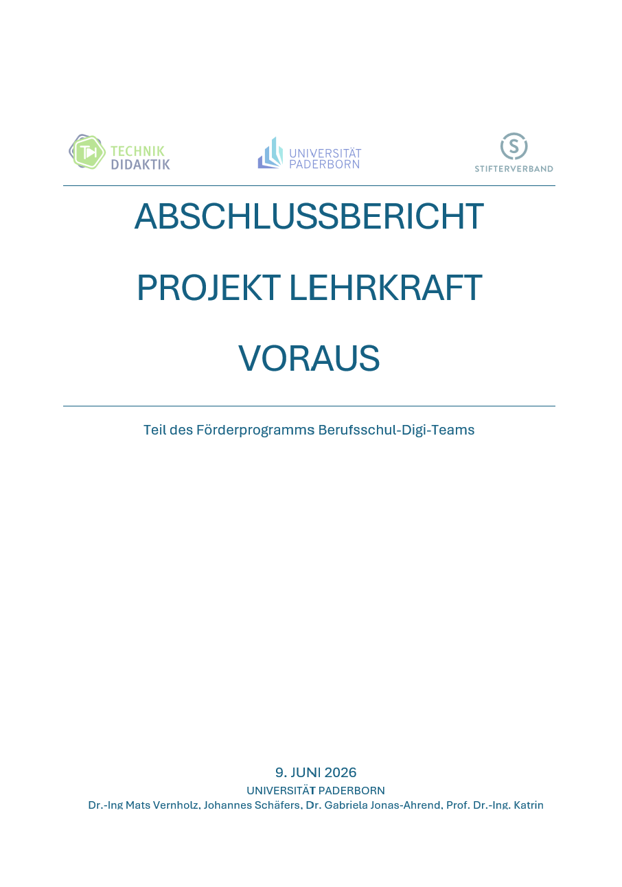
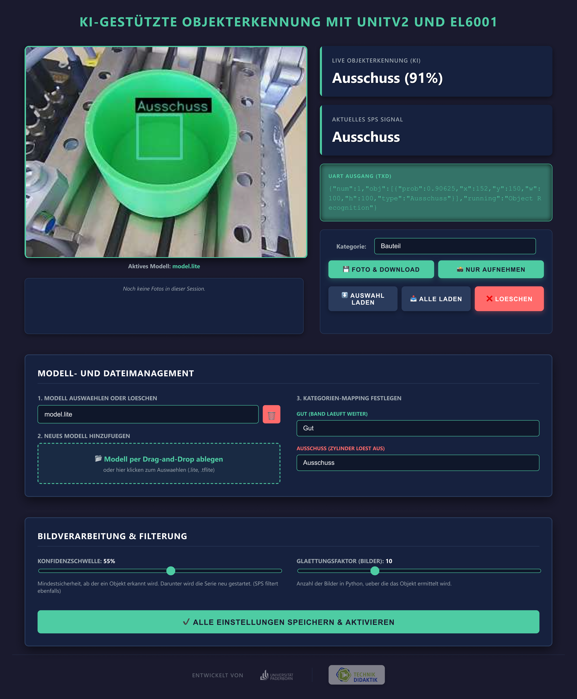
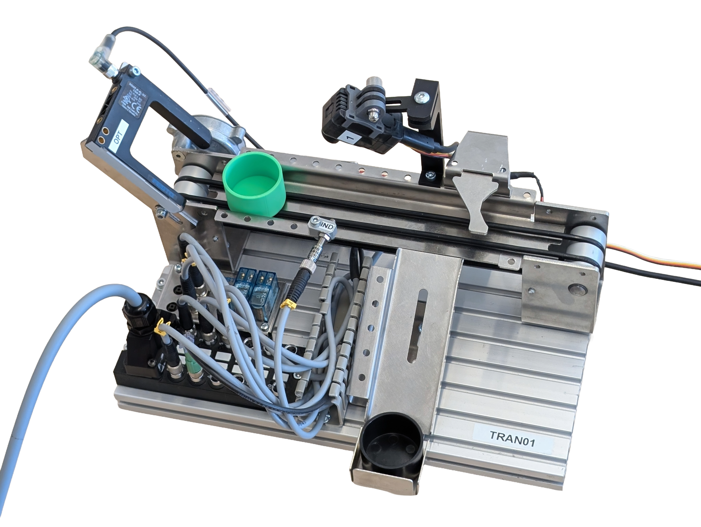
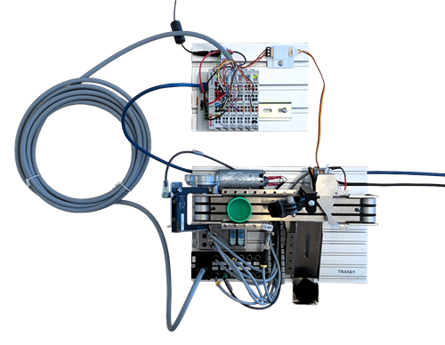
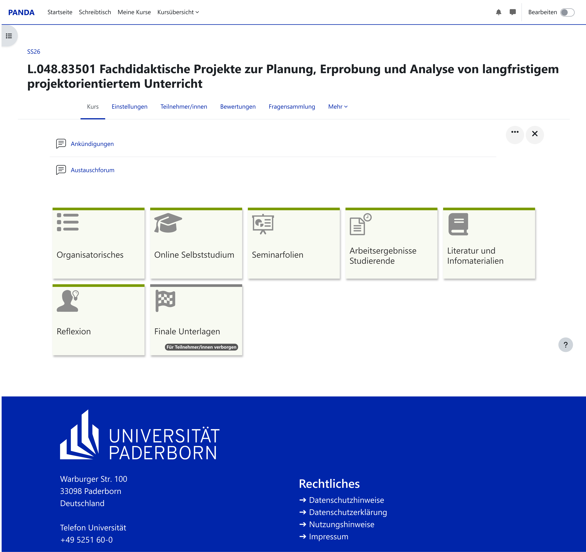
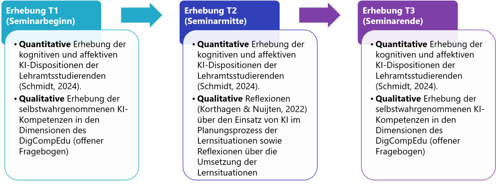

## 1.Einleitung und Projektüberblick
Die fortschreitende Digitalisierung und die rasante Entwicklung Künstlicher Intelligenz (KI) stellen das Bildungssystem vor neue Herausforderungen. Im Zentrum des verstetigten Projekts „LehrKraft voraus!“ steht daher die Ausgangsfrage: *Wie können angehende Lehrkräfte gewerblich-technischer Fachrichtungen künstliche Intelligenz nicht nur als isoliertes Unterrichtsthema, sondern auch als wirkungsvolles Werkzeug für die eigene Unterrichtsplanung und zur Unterstützung von Lehr-Lern-Prozessen didaktisch sinnvoll einsetzen?*

Die Integration von KI in die berufliche Lehramtsausbildung (Master of Education) ist aus zwei Perspektiven von essenzieller Bedeutung:

**•	Fachwissenschaftliche Perspektive:** KI verändert technische Arbeitsprozesse (z. B. moderne Produktionssysteme, Qualitätsmanagement und Automatisierungsprozesse). Angehende Lehrkräfte, insbesondere für berufliche Schulen, müssen diese industriellen Realitäten kennen und an Schüler*innen weitergeben können.

**•	Methodisch-didaktische Perspektive:** Generative KI beeinflusst die Art und Weise, wie Wissen generiert, aufbereitet und vermittelt wird. Es bedarf professioneller Kompetenzen, um KI gezielt in schulische Prozesse zur Unterrichtsplanung und als Lernbegleiter (z. B. durch individualisierte Chatbots) einzubinden.

Das Projekt befindet sich genau an dieser Schnittstelle und entwickelt ein kooperatives Seminarkonzept, in dem Studierende KI-bezogene Lernsituationen konzipieren, an einer beruflichen Schule erproben und wissenschaftlich fundiert reflektieren.

## 2.Beteiligte Projektpartner
Das Projekt zeichnet sich durch eine enge Verzahnung zwischen universitärer Lehrkräftebildung, schulischer Praxis und industrienahen Technologien aus.

**Universität Paderborn**

  •	Dr.-Ing. Mats Vernholz
  •	Johannes Schäfers
  •	Dr. Gabriela Jonas-Ahrend
  •	Prof. Dr.-Ing. Katrin Temmen

**Lippe-Berufskolleg des Kreises Soest in Lippstadt (schulische Erprobung)**

  •	Schulleitung (Michael Flore und Sandra Uhlir)
  •	Beteiligte Lehrkräfte (Niklas Kleinewietfeld, Astrid Kemper, Danny Schulte)

**Wert der Kooperation:** Die Zusammenarbeit ist maßgeblich für den Projekterfolg. Durch die frühzeitige Einbindung des Berufskollegs konnten reale Bedarfe, spezifische Bildungsgänge und organisatorische Rahmenbedingungen berücksichtigt werden. Die theoretischen universitären Inhalte können durch die Studierenden selbst unmittelbar an echten Lerngruppen erprobt werden.

## 3.Zielsetzung
Das primäre Ziel von „LehrKraft voraus!“ ist die gezielte Förderung der KI-Kompetenz und der Technologieakzeptanz bei Lehramtsstudierenden. Das didaktisch-methodische Konzept verfolgte eine dreifache Integration von KI:
    
  **1.	Präparativ (Unterrichtsplanung):** Nutzung generativer KI (wie ChatGPT oder Fobizz)     zur Ideenfindung (z. B. handlungsorientierte Einstiegsszenarien), Grob- und                 Feinplanung, sowie Erstellung didaktischer Materialien.
   
  **2.	Fachlich (Unterrichtsgegenstand):** Einbindung von Machine Vision als konkreter         Lerninhalt aus dem Ingenieurskontext (Nutzung eines KI-gestützten Kamerasystems zur         Qualitätskontrolle an einer Festo-Anlage).

  **3.	Methodisch (Lernbegleitung):** Entwicklung und Einsatz lernendengerechter,                  fachspezifischer KI-Chatbots zur Unterstützung im Unterricht, inklusive Aspekten            der Binnendifferenzierung und Heterogenität:

**Kontinuierliche Reflexion:** Um einen unkritischen Umgang mit KI oder eine pauschale Ablehnung gegenüber KI zu vermeiden, wurde ein Konzept der kontinuierlichen, angeleiteten Reflexion verankert. Die Studierenden reflektieren so ihre KI-Nutzung stetig, erkennen fachliche Fehler der KI (z.B. Vermeidung von Halluzinationen) und hinterfragen den Lernprozess anhand reflexiver Leitfragen (Wahrnehmung, Interpretation, Entscheidung) über den gesamten Verlauf des Seminars. 

## 4.	Technischer Aufbau und Lernträger
Als technischer Lernträger und physisches Anschauungsobjekt dient im Projekt eine modifizierte Festo-Förderbandanlage mit Sortierung. Diese bildet eine industrielle Objekterkennung ab und schlägt die Brücke zwischen moderner Informationstechnik und klassischer speicherprogrammierbarer Steuerung (SPS). 

  •	Ein Förderband transportiert die Bauteile, während ein Hubmagnet als Aktor dient, um        zum Beispiel fehlerhafte Werkstücke mechanisch auszusortieren. 

  •	Die Koordination des zeitlichen Ablaufs übernimmt eine softwarebasierte Steuerung 
    (Soft-SPS via Beckhoff TwinCAT), die auf einem normalen PC ausgeführt wird. Die             physische Anbindung der Anlage an den PC erfolgt über einen Buskoppler (EtherCAT-           Koppler).

  •	Über dem Förderband ist eine KI-Kamera vom Typ M5Stack UnitV2 montiert, die als             optischer Sensor zur Objekterkennung dient. 

  •	Die Kamera kommuniziert über eine serielle UART-Schnittstelle wiederum mit der SPS. Da     die serielle Eingangsklemme der SPS jedoch mit industriellen RS232-Spannungspegeln          arbeitet, ist ein kleiner Pegelwandler zwischengeschaltet. 

**Software und Datenfluss**

Zur Kommunikation zwischen der Kamera und der Soft-SPS auf dem PC ist der folgende Datenfluss implementiert:

  •	Auf der KI-Kamera läuft nativ eine Python-Anwendung. Diese nutzt ein neuronales Netz,       um das Kamerabild in Echtzeit auszuwerten und Objekte zu klassifizieren. Das gewählte       standardisierte TensorFlow-Lite-Format zeichnet sich durch eine hohe Offenheit und          Plattformunabhängigkeit aus. Entsprechende Modelle lassen sich flexibel auf                 unterschiedlichen Plattformen (wie Edge Impulse) oder mittels eigenem Python-Code           generieren.

  •	Erkennt das KI-Modell ein Objekt, generiert es fortlaufend ein Datenpaket im JSON-          Format. Es enthält die ermittelte Objektklasse sowie die prozentuale Sicherheit der         Erkennung.

  •	Dieses JSON-Paket wird über die serielle UART/RS232-Verbindung an den Buskoppler und        somit an die Soft-SPS auf dem PC geschickt.

Der als Soft-SPS genutzte PC dient gleichzeitig als Bedienstation. Über einen Webbrowser lässt sich die selbstentwickelte grafische Oberfläche der Kamera aufrufen. Hier stehen dem Anwender drei Konfigurationswerkzeuge zur Verfügung:

  •	Über eine Drag-and-Drop-Schnittstelle können neue KI-Modelle (lite/tflite-Dateien)          direkt auf die Kamera geladen und per Mausklick aktiviert werden.

  •	Der Nutzer legt flexibel fest, welche der vom KI-Modell erkannten Klassen als „Gut“        (Teil fährt durch) oder als „Ausschuss“ (Teil wird aussortiert) gewertet werden sollen. 

  •	Über Schieberegler lässt sich die Konfidenzschwelle (Mindestsicherheit der Erkennung in     Prozent) und der Glättungsfaktor (Anzahl der Videobilder, über die das                      Erkennungsergebnis stabilisiert wird) live einstellen. Dadurch können Erkennungsfehler      und Bildrauschen direkt in der Kamera-Software an die Zuverlässigkeit des KI-Modells        angepasst werden.
  
Die Soft-SPS auf dem PC empfängt die im Dashboard vorkonfigurierten Ergebnisse und verarbeitet sie in einer einfachen, zeitgesteuerten Schrittkette weiter:

  1.	Sobald ein Werkstück die Lichtschranke passiert, startet das Förderband.
  	 
  2.	Das Band stoppt nach einer Sekunde das Bauteil unter der Kamera. Die SPS wartet kurz,       um Bewegungsunschärfe zu vermeiden, liest das JSON-Signal der Kamera aus und                berechnet zur Sicherheit einen Mittelwert über fünf Erkennungszyklen. 
  
  3.	Wird ein fehlerhaftes Bauteil erkannt (oder kann das Objekt nicht eindeutig                 identifiziert werden), wird die Weiche aktiviert, der das Teil beim anschließenden          Weitertransport in das Ausschussfach schiebt. Nach dem Abtransport schaltet die             Anlage alle Aktoren ab und wartet im Ausgangszustand auf das nächste Werkstück.

**Einsatzmöglichkeiten als Lernträger im Unterricht**

Der Aufbau ist so gestaltet, dass er von den SchülerInnen im Unterricht als offene Lernumgebung genutzt werden kann. Er ermöglicht es den SchülerInnen, den gesamten Prozess von der Bildaufnahme bis zur praktischen Erprobung einer KI-Bilderkennung selbstständig hinsichtlich folgender Punkte zu durchlaufen.

  •	Die SchülerInnen können über die im Webbrowser aufgerufene Benutzeroberfläche der           Kamera eigenständig Fotos verschiedener Werkstücke aufnehmen. Diese Bilder lassen sich      direkt in der Galerie der Kamera abspeichern und einzeln oder gesammelt herunterladen.

  •	In der KI-Trainingsplattform Edge Impulse können die SchülerInnen die Schritte zur         Modellgenerierung selbst durchführen, indem sie die Bilder labeln, das neuronale Netz       konfigurieren und das KI-Modell anlernen lassen.

  •	Nach dem erfolgreichen Training können die SchülerInnen das fertige Modell im               TensorFlow-Lite-Format (Int8) herunterladen und per Drag-and-Drop auf die Kamera laden.     Beim anschließenden Betrieb der Sortieranlage können sie ihr eigenes Modell direkt im       realen Prozess testen und überprüfen, ob der Hubmagnet die Werkstücke auf Basis ihrer       Konfiguration korrekt aussortiert.

  • Die Oberfläche bietet den SchülerInnen zudem die Möglichkeit, die Konfidenzschwelle und     den Glättungsfaktor live anzupassen. Auf diese Weise können sie im Unterricht testen,       wie sich softwareseitige Filterungen direkt auf die Sortierung der Anlage auswirken.

*Abbildung 1 Oberfläche der eigens entwickelten Software für die KI-Kamera (erreichbar unter der IP-Adresse der Kamera*

Für das Modelltraining hat sich die Plattform *Edge Impulse* als besonders geeignet erwiesen. Neben einer recht strukturierten Oberfläche hat sie zwei besondere Vorteile:
 
  •	In der kostenlosen Variante der Plattform können bis zu drei Schüler*innen zeitgleich       an einem gemeinsamen Projekt arbeiten. Dies ermöglicht eine kooperative Aufteilung von      Arbeitsschritten, sodass beispielsweise das zeitintensive Labeling der Bilddaten             parallel im Team durchgeführt werden kann.
  
  •	Das fertig trainierte Modell lässt sich direkt aus der Plattform heraus über einen          bereitgestellten QR-Code auf einem Smartphone oder Tablet ausführen. Dies ermöglicht es     den Schülern, die Zuverlässigkeit ihrer Bilderkennung auch ohne KI-Kamera zu testen,        bevor das Modell auf die Industrie-Hardware übertragen wird.
  
**Vorteile der Eigenentwicklung gegenüber der Hersteller-Firmware**

Obwohl die werksseitige Weboberfläche und die herstellereigene Trainingsplattform der Kamera (M5Stack V-Training) auf den ersten Blick ähnliche Funktionalitäten bieten, hat sich im Projektverlauf gezeigt, dass sie für den Unterrichtseinsatz deutliche funktionale Limitationen aufweisen. Die Entscheidung für eine maßgeschneiderte Software-Lösung in Kombination mit einer offeneren Plattform wie Edge Impulse begründet sich in folgenden Problemen des Originalsystems:

  •	In der werksseitigen Weboberfläche werden aufgenommene Fotos lediglich im                   Arbeitsspeicher der Kamera abgelegt. Jedes Foto muss für das spätere Training einzeln       heruntergeladen werden.
  •	Die herstellereigene Plattform zur Modellgenerierung erwies sich in der Erprobung als       unzuverlässig. In mehreren Zeiträumen brach der serverseitige Prozess im letzten            Schritt des Trainings (nach dem zeitaufwendigen Labeling) ab.
  •	Auf der Plattform des Kameraherstellers werden hochgeladene Bilddaten nicht dauerhaft       projektbasiert gespeichert. Soll ein bestehendes Modell im Rahmen eines iterativen          Lernprozesses nachträglich um weitere Fotos ergänzt werden, muss der gesamte Prozess        (inklusive Labeling) von Grund auf neu durchgeführt werden.
  •	Damit die Kamera ihre Erkennungsergebnisse per serieller Schnittstelle an den               Buskoppler ausgibt, muss nach jedem Neustart der Hardware zwingend die Weboberfläche im     Browser aufgerufen werden.
  • Die Originalsoftware sendet jede Objekterkennung ungefiltert an die Steuerung. Die          notwendige Glättung der Signale zur Vermeidung von Fehlalarmen muss daher vollständig       im SPS-Programm (TwinCAT) abgebildet und bei Bedarf angepasst werden. Für                   SchülerInnen, die keine Erfahrung mit SPS-Programmierung haben, wirken die SPS-            Oberflächen jedoch recht überfrachtet und sind damit nicht ohne Einführung nutzbar.

Die eigens für diesen Lernträger entwickelte Kamera-Software löst zusammen mit Edge Impulse diese Limitationen. Zudem bleibt das System flexibel, da sich die Kamerasoftware bei Bedarf über ein einfaches Skript in wenigen Sekunden wechseln lässt. Durch die gleich aufgebaute Ausgabe der eigens entwickelten Software, muss das SPS-Programm bei einem Wechsel von oder zu der M5Stack-Firmware nicht angepasst werden.

Genutzte Hardware: Festo Meclab Förderband; Beckhoff EK1100, EL1008, EL2008, EL6001; M5Stack UnitV2-M12; UART-RS232 Transceiver; D-Sub-15-Kabel (Buchse); 24V-Netzteil; PC inkl. TwinCAT XAE Shell und Runtime (mit kostenlosen, unbegrenzt erneuerbaren 7-Tages-Lizenzen).

 

*Abbildung 2 Aufbau der Automatisierungstechnik. Oben: Festo-Förderband mit KI-Kamera. Unten: Gesamtaufbau zusätzlich mit Buskoppler und Transceiver*

## 5.Seminarkonzept und Ergebnisse
Das Seminar wurde im Rahmen eines dreiphasigen Design-Research-Ansatzes (nach Bakker) entwickelt und umfasst 6 ECTS bei 14 dreistündigen Sitzungen im Sommersemester 2025. Konkret handelt es sich um das Seminar „Fachdidaktische Projekte zur Planung, Erprobung und Analyse von langfristigem projektorientiertem Unterricht für die berufliche Ausbildung“.

**Ablauf des Seminars**

**Phase 1:** Einführung (6 Wochen): Einführung in das kooperative Seminarkonzept sowie erstes Treffen mit der Kooperationsschule. Fachliche Einführung in das Thema der generativen KI (Unterscheidung KI, Machine Learning, Deep Learning), Funktionsweisen, Grenzen und Risiken generativer KI. Entwicklung der Szenarien der Lernsituationen. Zusätzlich Einführung in die kontinuierlichen, angeleiteten Reflexionsaufgaben zum          persönlichen KI-Einsatz, Inbetriebnahme der KI-Kamera, Grobplanung des Unterrichts.
  
**Phase 2:** Erarbeitung und Planung (6 Wochen): Planung und Entwicklung der Lernsituationen (Feinplanung des Unterrichts, Entwicklung von Lernmaterialien). Zusätzlich kontinuierliche inhaltliche Inputs zum Einsatz (generativer) KI in der Unterrichtsplanung und -durchführung (bspw. Kennenlernen spezifischer Tools, Prompt Engineering, Entwicklung eigener Chatbots zur Lernendenunterstützung. Dabei ständige Rücksprachen auch mit den Lehrkräften des Berufskollegs.
  
**Phase 3:** Durchführung und Reflexion (2 Wochen): Reale Durchführung der entwickelten Lernsituationen am Lippe-Berufskolleg, gefolgt von einer tiefgehenden Reflexion des eigenen KI-Einsatzes und der SchülerInneninteraktionen (Beispiel einer geplanten Lernsituation der gewerblich-technischen Lehramtsstudierenden: https://www.taskcards.de/#/board/a63baec8-6341-414e-895f-d9bc81fa91b6?token=846eb116-       8779-4d59-aae3-49a7d89ceb2e)

   
## 6.	Materialien
Im Rahmen des Projekts wurde ein umfassendes Set an Materialien entwickelt und erprobt.

  •	Seminarplanung inklusive Übersichten für Dozierende und Studierende, sowie Foliensatz der Sitzungen
  
  •	Konzept und Einführung zu angeleiteten Reflexionen im Seminar
  
  •	Digitale Lernraumstruktur (Moodle-basiertes LMS)
  
  •	Beispielhafte, ausgearbeitete Lernsituation
  
  •	Custom-Software zur Ausführung von KI-Modellen auf der UnitV2-Kamera inkl. 
    Installationsskripten

  •	Anleitungen für die Soft- und Hardware der KI-Kamera
  
Materialien und weitere Informationen stellen wir gerne zur Verfügung. Kontaktieren Sie uns einfach unter: lehrkraft-voraus@campus.uni-paderborn.de oder über unsere Homepage: https://ei.uni-paderborn.de/technikdidaktik

*Abbildung 3 Digitale Lernraumstruktur als „Pandakurs“ (Moodle-basiertes LMS an der Universität Paderborn*

## 7.	Projekt- und Forschungsmethodik
Das gesamte Projekt verfolgt einen dreiphasigen Design-Research-Ansatz nach Bakker (2018). Zunächst wurde im Sommersemester 2024 gemäß diesem Ansatz eine explorative Vorstudie zur KI-Nutzung gewerblich-technischer Lehramtsstudierender durchgeführt. Zusätzlich zu diesen empirischen Ergebnissen orientiert sich das Projekt auf theoretischer Ebene am Kompetenzverständnis als Kontinuum nach Blömeke et al. (2015) sowie am Reflexionsverständnis nach Dewey (1910). Als inhaltliche Rahmung für die Entwicklung des Seminarkonzepts wurde der DigCompEdu-Kompetenzrahmen (Redecker & Punie, 2017) herangezogen, insbesondere die Bereiche „Digitale Ressourcen“, „Lehren und Lernen“ sowie „Lernerorientierung“. Die durchgeführten, angeleiteten Reflexionen dienen dabei der Entwicklung KI-bezogener Dispositionen (Vernholz et al., 2025). Um eine tiefgreifende Evaluation im Sinne des Design-Research-Ansatzes zu gewährleisten, wurde eine begleitende Forschung durchgeführt. Diese verfolgt einen Mixed-Methods-Ansatz, wie in Abbildung 1 zu sehen ist:

*Abbildung 4 Begleitforschung zum Projekt LehrKraft voraus!*

Im Rahmen des Mixed-Methods-Ansatzes wurden zu Beginn des Seminars in einer quantitativen Erhebung die KI-bezogenen kognitiven sowie affektiven Dispositionen erhoben (Fragebogen nach Schmidt, 2024). Der Fokus lag hier im Bereich der kognitiven Dispositionen auf dem KI-bezogenen Grundlagenwissen, im Bereich der affektiven Dispositionen wiederum auf den epistemologischen Überzeugungen (Hofer, 2010; Schommer-Aikins, 2004), der Technologieakzeptanz (Venkatesh & Bala, 2008), sowie den Motivationen zur KI-Nutzung (Decy & Ryan, 1985, 2002). Zusätzlich wurden die selbsteingeschätzten KI-Kompetenzen der teilnehmenden Lehramtsstudierenden in einem qualitativen Fragebogen auf Basis des DigCompEdu (Redecker & Punie, 2017) erhoben. Beide Erhebungen wurden zum Semesterende erneut durchgeführt, um longitudinale Entwicklungen zu erfassen (die quantitative Erhebung wurde zusätzlich zur Semestermitte ein drittes Mal durchgeführt). Neben diesen Erhebungen wurden auch die kontinuierlichen schriftlichen Reflexionen der Studierenden mit in die Begleitforschung aufgenommen, um auch hier Entwicklungen und Veränderungen in der KI-Nutzung zu identifizieren.

**Evaluationsergebnisse und Herausforderungen**

Die im Sommersemester 2024 durchgeführte Vorstudie (n=17) zeigte zunächst eine grundsätzlich positive Einstellung, aber auch teilweise starke Fehlvorstellungen (z. B. „KI denkt wie ein Mensch“), die als kognitive Hindernisse wirkten. Um diese Fehlvorstellungen im Seminar aufzugreifen, wurden sowohl die inhaltliche Einführung in das Thema KI in Phase 1 als auch die kontinuierlichen inhaltlichen Inputs in Phase 2 genutzt.

Die begleitende Forschung während der Seminardurchführung (Pilotgruppe n=6) lieferte folgende Erkenntnisse:

  **•	Erfolge:** Es zeigte sich vor allem eine Steigerung der wahrgenommenen                 Nutzerfreundlichkeit und des KI-Grundlagenwissens im Verlauf des Semesters. Die Motivation zur Nutzung von KI blieb konstant hoch. In den kontinuierlichen Reflexionen berichteten die Studierenden von signifikanten Verbesserungen im Prompting (präzisere Fragen, weniger Zeitverlust). Zusätzlich schrieben sie KI einen zunehmenden Wert für die Strukturierung und Visualisierung ihres Unterrichts zu.
  
  **•	Herausforderungen:** Die praktische Orientierung und kontinuierliche Reflexion stellten die Studierenden vor kognitive Herausforderungen. Gerade zu Beginn fiel es den Studierenden schwer, eine reflexive Haltung einzunehmen, konkrete Reflexionsanlässe zu identifizieren und anschließend schriftliche Reflexionen zu formulieren. 
  
  **•	Lösungsansatz für die Zukunft:** Die Reflexionskompetenz selbst wird künftig noch stärker (losgelöst vom reinen Thema KI) adressiert und als inhaltlicher Input thematisiert werden (etwa durch das integrierte Modell von Reflexion von Unterricht in der Lehrkräftebildung nach Arendt et al., 2025), um die Lücke zwischen den KI-bezogenen Dispositionen und der tatsächlichen Performanz zu schließen.

## 8.	Zukünftige Perspektiven und Learnings
Das Projekt befindet sich zum Zeitpunkt des SoSe 2026 in der Analyse und Neugestaltung (am Übergang zur dritten Phase des Design-Research-Zyklus WiSe 2025/26 – SoSe 2026). Gemäß dem Förderprogramm Berufsschul DigiTeams ist das entstandene Seminar an der Universität Paderborn verstetigt und im Master of Education für die beruflichen Fachrichtungen Elektrotechnik und Maschinenbautechnik und das Unterrichtsfach Technik in der Veranstaltung Fach¬di¬dak¬ti¬sche Pro¬jek¬te zur Pla¬nung, Er¬pro¬bung und Ana¬ly¬se von lang¬fris¬ti¬gem pro¬jek¬to¬ri¬en¬tier-tem Un¬ter¬richt (für die be¬trieb¬li¬che Aus¬bil¬dung) verankert. Zukünftige Iterationen werden einen noch stärkeren Fokus auf die systematische Ausbildung von Reflexionskompetenz legen. Das entwickelte Seminarkonzept bietet eine Blaupause, die leicht auf andere Fachdidaktiken (z. B. kaufmännische Berufsbildung) sowie in die zweite (Referendariat) und dritte Phase (Fortbildung) der Lehrkräftebildung transferiert werden kann. Lediglich der Lernträger sollte an die jeweilige berufliche Realität der Schüler*innen angepasst werden. Erste Transfertätigkeiten fanden bereits während der Projektlaufzeit im Rahmen der Hacking School der RPTU Kaiserslautern statt, bei denen die im Seminar entwickelten Lernsituationen auch in der Allgemeinbildung am Frauenlob-Gymnasium in Mainz durchgeführt und evaluiert wurden. Aus den im Projekt gesammelten Erfahrungen ergeben sich Learnings, welche bei der Nachnutzung und dem Transfer des Seminarkonzepts berücksichtigt werden sollten: 

  **•	Frühzeitige Schulkooperation:** Die frühe Verzahnung von universitärer Theorie und schulischer Praxis erwies sich im Projekt als zentraler Erfolgsfaktor. Auf diese Weise ließen sich reale schulische Bedarfe sowie organisatorische Rahmenbedingungen angemessen berücksichtigen und eine vertrauensvolle Basis für die langfristige Zusammenarbeit schaffen. 

  **•	Authentische KI-Anwendungen fokussieren:** Da die Einstiegshürden bei textbasierten Systemen (LLMs) gering sind haben Studierende hier oft schon Vorerfahrungen. Gerade im gewerblich-technischen Bereich empfiehlt es sich daher besonders KI in konkrete berufliche bzw. „industrielle“ Handlungssituationen (z.B. Automatisierungstechnik) einzubetten, da diese aufgrund der höheren technischen Hürden weniger zugänglich sind.

  **•	Strukturierende Planungsinstrumente anbieten:** Für viele Studierende handelt es sich um eine der ersten eigenen Unterrichtsplanungen. Die gleichzeitige Integration von KI auf verschiedene methodische Arten kann hier zu einer Überlastung führen. Die Unterstützung im Planungsprozess durch gezielte Hilfen und Feedbackschleifen hat sich hier bewährt. 

  **•	Kritisch-produktiven Einsatz durch kontinuierliche Reflexion fördern:** Für Seminare zur begleiteten Unterrichtsgestaltung bietet der Einsatz von KI die große Chance, über die reine Arbeitserleichterung hinauszugehen und kreative Potenziale sowie didaktische Mehrwerte gezielt aufzuzeigen. Hierbei hat sich das Konzept der kontinuierlichen, angeleiteten Reflexion über den gesamten Seminarverlauf hinweg als sehr sinnvoll erwiesen. Durch regelmäßige Reflexionsaufgaben lernen die Studierenden stetig, KI-Ergebnisse im Kontext fachwissenschaftlicher und didaktischer Erkenntnisse einzuordnen. 

  **•	Konkretisierung durch reale Unterrichtspraxis:** Die schulische Erprobung stellt keinen reinen „Test“ dar, sondern einen wichtigen Lernanlass in der Praxis. Gleichzeitig erfordert sie von den Studierenden eine Konkretisierung der geplanten Unterrichtsabläufe. 

  **•	Co-Teaching als Unterstützungsstruktur:** Die Begleitung der Studierenden zeichnete sich im Projekt durch eine besondere Vielschichtigkeit aus. Neben der dynamischen inhaltlichen Entwicklung im Bereich KI galt es, den spezifischen projektbezogenen Dreiklang aus zielgerichteter Seminarleitung, studentischen Freiräumen und der begleitenden Forschung auszubalancieren. Hierbei erwies sich die Möglichkeit zum Co-Teaching als ein äußerst wertvolles und zielführendes Format.

## 9.	Publikationen und Konferenzbeiträge

Vernholz, M., Schäfers, J., Jonas-Ahrend, G., & Temmen, K. (2024). Uni trifft Schule -   Kooperative Unterrichtsentwicklung unter Einbezug von KI in der gewerblich-technischen Lehramtsausbildung. 9. Technikdidaktiksymposium.

Vernholz, M., Schäfers, J., Jonas-Ahrend, G., & Temmen, K. (2025). Berufliche Lehramtsausbildung in Zeiten von KI – kooperative Seminargestaltung im Projekt “LehrKraft voraus!”. Hochschultage Berufliche Bildung 2025

Schäfers, J., Vernholz, M., Jonas-Ahrend, G., & Temmen, K. (2025). Zwischen Innovation und Reflexion: KI-Integration als Beitrag zu nachhaltiger Lehrkräftebildung im Projekt „LehrKraft voraus!" 13. Tag der Lehre der Universität Paderborn

Vernholz, M., Schäfers, J., Jonas-Ahrend, G., & Temmen, K. (2025). Shaping Tomorrow‘s Classrooms – Integrating AI in Technology Teacher Training and VET in Germany 22nd International Conference on Smart Technologies & Education

Schäfers, J., Vernholz, M., Jonas-Ahrend, G., & Temmen, K. (2025). Förderung von KI-Kompetenz in Studium und Schule – Vorstellung eines erprobten Seminarkonzepts und der dort entwickelten Unterrichtsreihe. Jahrestagung der DGTB 2025

Schäfers, J., Vernholz, M., Jonas-Ahrend, G., & Temmen, K. (2025). Vom Prompt zur Praxis – Kooperatives Seminarkonzept zur KI-gestützten Unterrichtsentwicklung in der gewerblich-technischen Lehramtsausbildung. KISS-Pro Tagung 2025

Vernholz, M., Schäfers, J., Jonas-Ahrend, G., & Temmen, K. (2025). Zum Zusammenhang zwischen Kompetenzen und Reflexionen theoretisch-empirische Überlegungen im Kontext eines kooperativen Seminars zur Unterrichtsplanung mittels KI. Jahrestagung der Sektion Berufs- und Wirtschaftspädagogik der Deutschen Gesellschaft für Erziehungswissenschaft 2025

Schäfers, J., Vernholz, M., Jonas-Ahrend, G., & Temmen, K. (2025). Technikdidaktik trifft Künstliche Intelligenz: Zur Wirksamkeit eines praxisorientierten Seminars bezüglich der Kompetenzentwicklung von Lehramtsstudierenden. 9. Technikdidaktiksymposium

Vernholz, M., Schäfers, J., Jonas-Ahrend, G., & Temmen, K. (2026) Shifting Minds or Reinforcing Myths? Empirical Insights into AI-related Affective Changes Among Future Technology Teachers. AERA Annual Meeting “Unforgetting Histories and Imagining Futures- Constructing A New Vision For Education Research”

**Literaturverzeichnis**

Arendt, K., Stark, L., Friedrich, A., Brünken, R. & Stark, R. (2025). Reflexion von Unterricht in der Lehrkräftebildung – Ein Scoping-Review. Unterrichtswissenschaft, 435–476. https://doi.org/10.1007/s42010-025-00221-z

Bakker, A. (2018). Design Research in Education. Routledge. https://op.europa.eu/en/publication-detail/-/publication/fcc33b68-d581-11e7-a5b9-01aa75ed71a1/language-en https://doi.org/10.4324/9780203701010

Blömeke, S., Gustafsson, J. E. & Shavelson, R. J. (2015). Beyond Dichotomies. Zeitschrift für Psychologie, 223(1), 3–13. https://doi.org/10.1027/2151-2604/a000194

Decy, E. L. & Ryan, R. M. (1985). Intrinsic motivation and self-determination in human behavior. Plenum. 

Decy, E. L. & Ryan, R. M. (2002). An overview of self-determination theory: An organismic dialectical perspective. Handbook of Self Determination Research, 3–36.

Dewey, J. (1910). How we think. D.C. Heath & Co., Publishers. 

Hofer, B. K. (2010). Personal epistemology in Asia: Burgeoning research and future directions. The Asia-Pacific Education Researcher, 19(1), 179–184.

Redecker, C. & Punie, Y. (2017). European framework for the digital competence of educators – DigCompEdu. Publications Office. https://doi.org/10.2760/159770

Schommer-Aikins, M. (2004). Explaining the Epistemological Belief System: Introducing the Embedded Systemic Model and Coordinated Research Approach. Educational Psychologist - EDUC PSYCHOL, 39, 19–29. https://doi.org/10.1207/s15326985ep3901_3

Venkatesh, V. & Bala, H. (2008). Technology Acceptance Model 3 and a Research Agenda on Interventions. Decision Sciences, 39(2), 273–315. https://doi.org/10.1111/j.1540-5915.2008.00192.x

Vernholz, M., Schäfers, J., Jonas-Ahrend, G. & Temmen, K. (2025). Shaping Tomorrow’s Classrooms: Integrating AI in Technology Teacher Training and VET in Germany. In Smart Technologies for an All-Eletric Society: Proceedings of the 22nd International Conference on Smart Technologies & Education. Volume 1. Springer Nature.
